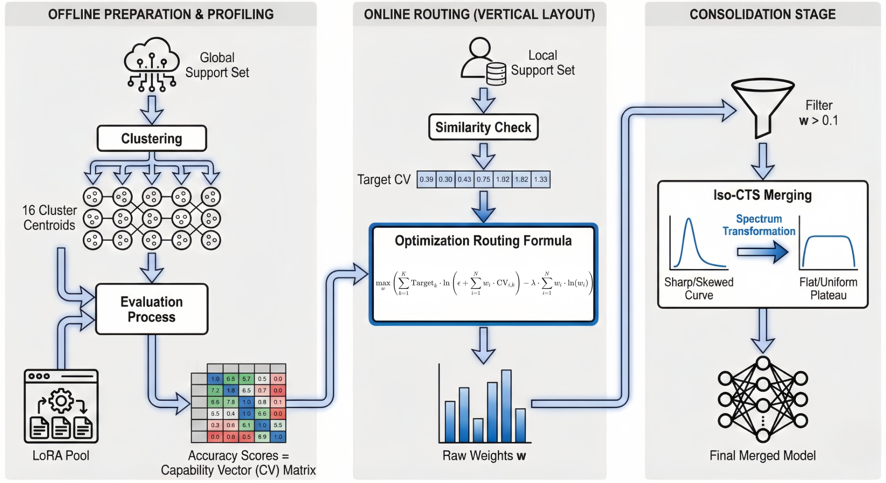



## Education

- **Zhejiang University (ZJU)** — B.Eng. Candidate in Computer Science and Technology (Sep 2023 – Present)
  - GPA: 92/100 (Rank 1/281)

## Honors & Awards

- **National Scholarship** (highest honor for undergrads in China), 2024
- **National Scholarship** (highest honor for undergrads in China), 2025
- **Gold Medal**, Zhejiang International College Students Innovation Competition (AI Track), 2025

## Research Experience

- **Evolving Personalized GUI Agent with Privacy-preserving GUI Hub** — Research Intern (Advisor: Prof. Ying Wei), Aug 2025 – Present  
  - Overview: Spearheaded the development of a **Spectral-Aware Privacy-Preserving LoRA Hub** as the **lead author**. Proposed a novel "Profile-then-Route" framework to resolve the conflict between personalization and data privacy in GUI agents. Target submission to COLM 2026.
  - Entropy-Regularized Routing: Engineered a **Capacity-Aware Routing Algorithm** that decouples user data from model selection. Constructed a Global Support Set to profile LoRA capabilities across 16 semantic clusters; implemented a custom **entropy-regularized optimization objective** to compute routing weights, significantly outperforming traditional cosine-similarity retrieval.
  - Spectral Consolidation: Pioneered the application of **Iso-CTS** to GUI Agents. Try to consolidate redundant LoRAs by flattening singular value spectra, enabling the Hub to evolve continuously without "feature collapse" or storage explosion.
  - Privacy \ System: Built the full evaluation pipeline on FedMABench. Designed a local-execution architecture where users only upload capacity embeddings—mathematically guaranteeing zero leakage of raw GUI traces or screenshots—while achieving superior generalization on unseen apps compared to baselines like LoRAHub and LEGO.

- **AI for Story Generation** — Undergraduate Researcher (with Ph.D. candidates), Aug 2025  
  - Conducted literature review on story generation benchmarks for a Human-AI Interaction project targeting CHI.
  - Contributed to an interactive story generation system, focusing on improving alignment between user intent and LLM-generated narratives.

## Professional Experience

- **Meituan (Search Department)** — AI Product Manager Intern, Jul 2025 – Sep 2025, Beijing, China  
  - Designed and launched AI-powered search features for Meituan’s core app to improve query understanding and ranking relevance.
  - Worked with engineering teams to translate LLM capabilities into product requirements and ship changes in a high-traffic environment.

## Skills

- **Programming**: Python, C++, SQL
- **ML / Frameworks**: PyTorch, FedMABench, Verl (RLHF), LoRA/PEFT
- **Research Interests**: Large Language Models (LLMs), Privacy-Preserving Machine Learning, Autonomous Agents

_Last updated: Jan 30, 2026_
